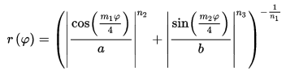
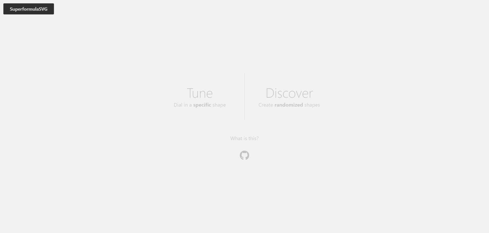
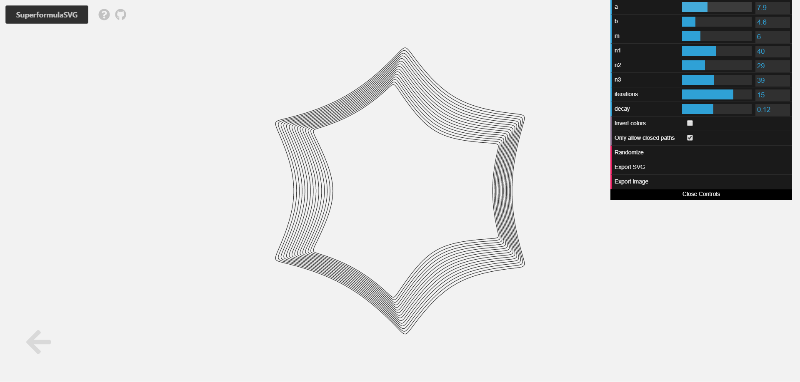
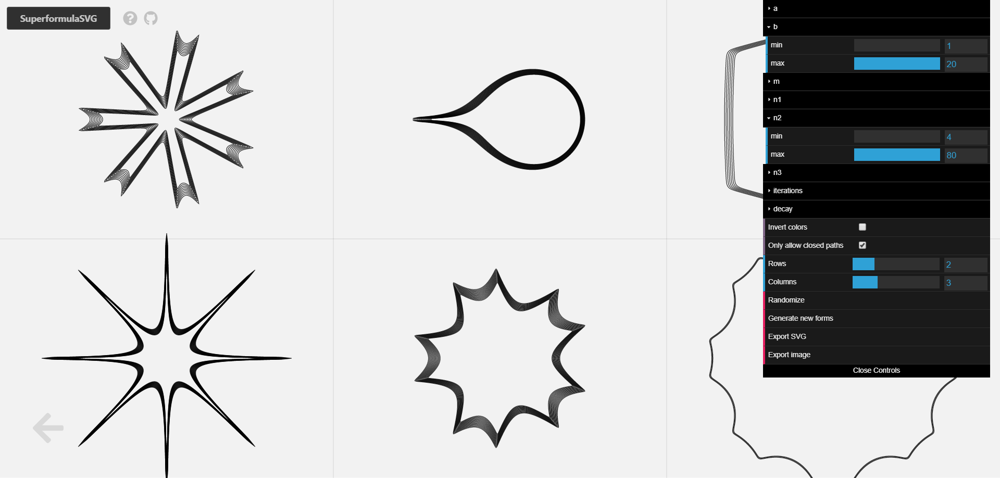
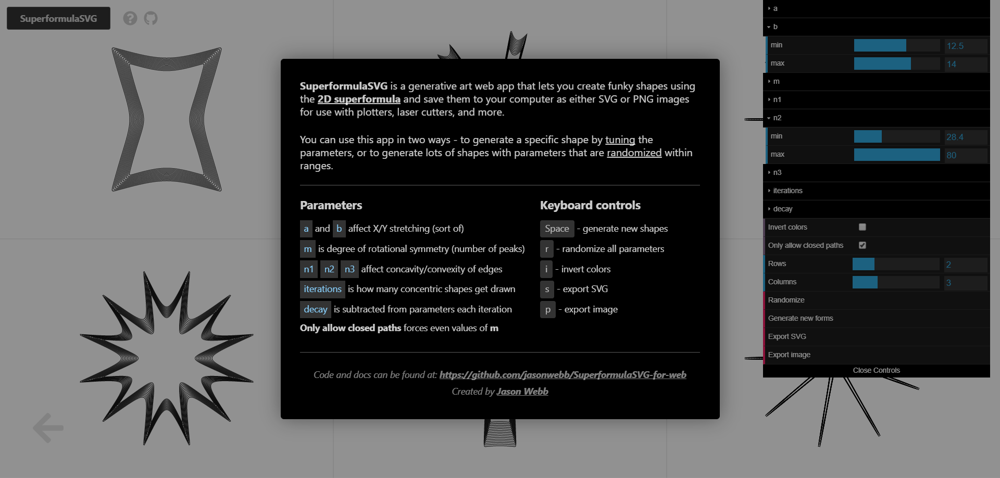

__SuperformulaSVG for web__ is an interactive drawing application that lets you generate shapes using the 2D superformula and export them in both SVG and raster image formats for use with laser cutters, plotters, or anything else you can think of!

The application provides two ways of coming up with forms - a _tuning_ mode to dial in an exact shape to your liking, and a _discovery_ mode to generate sets of randomized shapes within configurable ranges.

This application expands upon a [Processing sketch](https://github.com/jasonwebb/SuperformulaSVG) I put together a while back with similar functionality, ported to web technologies so that anyone can play with it without having to know anything about coding or setting up a development environment.

## Usage
To start generating forms choose from either `Tune` or `Discover` mode on the initial screen. From there you will be presented with a menu on the right side of the screen that you can use to manipulate the parameters used to generate the shape(s) on the screen.

### Tune
In 'tuning' mode the sliders let you directly control the parameters of a single shape in real-time. Use them to craft a specific shape, perhaps based on interesting shapes you find in the 'Discover' mode.

### Discover
In 'discover' mode the sliders let you define the minimum and maximum values for each of the parameters, as well as the number of rows and columns you'd like to generate. 

Both modes also include a few common buttons that you can use:
* `Invert colors` flips the current color scheme, which will be reflected in any exported image.
* `Only allow closed paths` forces the `m` parameter to always be an even, whole integer, which always results in forms that are closed. This is good if you'd like to do some interesting fill patterning later, but it does also limit the possibilities a little bit.
* `Randomize` will choose new values for all of the sliders.
* `Generate new forms` ('Discover' mode only) keeps all of the sliders where they are and just generates a new batch of random forms. 
* `Export SVG` lets you download an SVG file of everything on the screen to your computer.
* `Export image` lets you download a PNG fie of everything on the screen.

### Keyboard controls
Some basic keyboard controls are also made available to allow for slightly quicker use of the application. 

* `Space` - generate new forms ('Discover' mode only)
* `s` - export an SVG of what is currently on the screen
* `p` - export a PNG raster image of what is currently on the screen
* `i` - invert the colors, without regenerating the forms
* `r` - randomize parameters

### In-app help
Use the `?` icon in the application to bring up a condensed 'help' window. Click anywhere to hide it.

## About the superformula

The superformula is a mathematical method for generating radial geometry with diverse, often organic-looking features. It is described by the following formula:

Where __&phi;__ (phi) is an angle (between 0-359) and the resulting value `r` being the radius of the geometry at that angle.

Here is how I like to think of the parameters and how they affect the resulting drawing:
* `a` seems to affect lateral stretching
* `b` seems to affect vertical stretching
* `m` affects the degree of rotational symmetry. Large values means more peaks/spikes.
* `n1`, `n2`, `n3` all affect the concavity/convexity of spikes and how far they extend from the center. In tandem the can be used to make the form more 'bloated' or 'pinched'.

Following the example set by the  book [FORM+CODE](http://formandcode.com/code-examples/visualize-superformula), I've also included the ability to run multiple iterations of the superformula with slightly changing (decaying) parameter values. You can control these parameters using the `iterations` and `decay` sliders.

Learn more about the superformula through:
* Daniel Shiffman's [Coding Challenge #23: 2D Supershapes](https://www.youtube.com/watch?v=ksRoh-10lak).
* [Wikipedia entry on supershapes](https://en.wikipedia.org/wiki/Superformula) (also relevant is the [superellipse](https://en.wikipedia.org/wiki/Superellipse) page).
* Paul Bourke's article ["Supershapes (Superformula)"](http://paulbourke.net/geometry/supershape/)

## Technologies used
* [dat.gui](https://github.com/dataarts/dat.gui) for the UI
* [Paper.js](http://paperjs.org/) for SVG graphics

---

